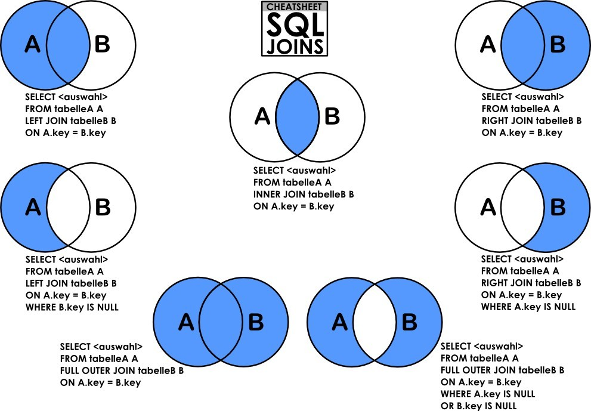

# limit
select * from table limit m,n  
其中m是指记录开始的index，从0开始，表示第一条记录,
n是指从第m+1条开始，取n条。
select * from tablename limit 2,4  
即取出第3条至第6条，4条记录.

# join


<br/>
<br/>
<br/>

# case when

## 语法
Case具有两种格式。简单Case函数和Case搜索函数。
```sql
--简单Case函数
CASE sex
WHEN '1' THEN '男'
WHEN '2' THEN '女'
ELSE '其他' END

--Case搜索函数
CASE 
WHEN sex = '1' THEN '男'
WHEN sex = '2' THEN '女'
ELSE '其他' END
```
这两种方式，可以实现相同的功能。简单Case函数的写法相对比较简洁，但是和Case搜索函数相比，功能方面会有些限制，比如写判断式(即条件语句)。  
还有一个需要注意的问题，Case函数只返回第一个符合条件的值，剩下的Case部分将会被自动忽略。
```sql
--比如说，下面这段SQL，你永远无法得到“第二类”这个结果
CASE 
WHEN col_1 IN ('a','b') THEN '第一类'
WHEN col_1 IN ('a') THEN '第二类'
ELSE '其他' END
```

## 用法
### 已知数据按照另外一种方式进行分组
```sql
# 简单case
SELECT  SUM(population),
CASE country
WHEN '中国'     THEN '亚洲'
WHEN '印度'     THEN '亚洲'
WHEN '日本'     THEN '亚洲'
WHEN '美国'     THEN '北美洲'
WHEN '加拿大'  THEN '北美洲'
WHEN '墨西哥'  THEN '北美洲'
ELSE '其他' END
FROM    Table_A
GROUP BY CASE country
WHEN '中国'     THEN '亚洲'
WHEN '印度'     THEN '亚洲'
WHEN '日本'     THEN '亚洲'
WHEN '美国'     THEN '北美洲'
WHEN '加拿大'  THEN '北美洲'
WHEN '墨西哥'  THEN '北美洲'
ELSE '其他' END;

# 搜索case
SELECT
CASE WHEN salary <= 500 THEN '1'
WHEN salary > 500 AND salary <= 600  THEN '2'
WHEN salary > 600 AND salary <= 800  THEN '3'
WHEN salary > 800 AND salary <= 1000 THEN '4'
ELSE NULL END salary_class,
COUNT(*)
FROM    Table_A
GROUP BY
CASE WHEN salary <= 500 THEN '1'
WHEN salary > 500 AND salary <= 600  THEN '2'
WHEN salary > 600 AND salary <= 800  THEN '3'
WHEN salary > 800 AND salary <= 1000 THEN '4'
ELSE NULL END;
```


### 用一个SQL语句完成不同条件的分组

国家（country）| 性别（sex）| 人口（population）
-|-|-
中国|1|340  
中国|2|260  
美国|1|45
美国|2|55
加拿大|1|51
加拿大|2|49
英国|1|40
英国|2|60

有上面数据
按照国家和性别进行分组, 结果如下:
国家|男|女
-|-|-
中国|340|260
美国|45|55
加拿大|51|49
英国|40|60

普通情况下，用UNION也可以实现用一条语句进行查询。但是那样增加消耗(两个Select部分)，而且SQL语句会比较长。  
下面是一个是用Case函数来完成这个功能的例子.
```sql
# 这样我们使用Select，完成对二维表的输出形式，充分显示了Case函数的强大。
SELECT country,
SUM( CASE WHEN sex = '1' THEN
population ELSE 0 END) as man,  --男性人口
SUM( CASE WHEN sex = '2' THEN
population ELSE 0 END) as woman   --女性人口
FROM  Table_A
GROUP BY country;
```


```sql

```