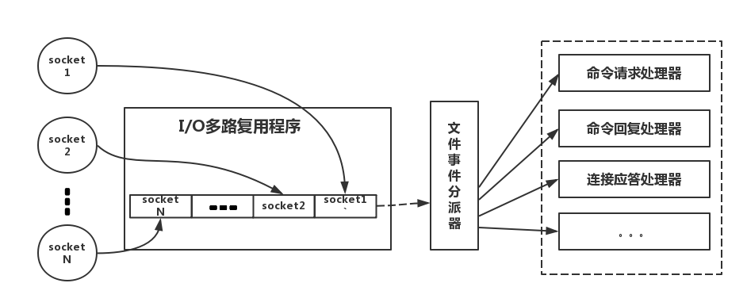

# 特征
* 开源免费, C语言编写, 遵守BSD协议, 是一个高性能的(key/value)分布式内存数据库, 基于内存运行并支持持久化的NoSQL数据库.
* Redis支持数据的持久化，可以将内存中的数据保持在磁盘中，重启的时候可以再次加载进行使用.
* Redis不仅仅支持简单的key-value类型的数据，同时还提供list，set，zset，hash等数据结构的存储.
* Redis支持数据的备份，即master-slave模式的数据备份.

# redis为什么这么快
* 纯内存操作.
* 单线程操作，避免了频繁的上下文切换.
* 采用了非阻塞I/O多路复用机制.

说明

参照上图，简单来说，就是我们的redis-client在操作的时候，会产生具有不同事件类型的socket。在服务端，有一段I/O多路复用程序，将其置入队列之中。然后，文件事件分派器，依次去队列中取，转发到不同的事件处理器中。
需要说明的是，这个I/O多路复用机制，redis还提供了select、epoll、evport、kqueue等多路复用函数库，大家可以自行去了解。

# redis的数据类型
## String
最常规的set/get操作，value可以是String也可以是数字。一般做一些复杂的计数功能的缓存.

## hash
这里value存放的是结构化的对象，比较方便的就是操作其中的某个字段.

## list
使用List的数据结构，可以做简单的消息队列的功能。另外还有一个就是，可以利用lrange命令，做基于redis的分页功能，性能极佳，用户体验好.

## set
因为set堆放的是一堆不重复值的集合。所以可以做全局去重的功能。为什么不用JVM自带的Set进行去重？因为我们的系统一般都是集群部署，使用JVM自带的Set，比较麻烦，难道为了一个做一个全局去重，再起一个公共服务，太麻烦了。

## sorted set
sorted set多了一个权重参数score,集合中的元素能够按score进行排列。可以做排行榜应用，取TOP N操作.

# redis的过期策略以及内存淘汰机制

## 过期策略: 定期删除+惰性删除

**为什么不用定时删除策略?**
定时删除,用一个定时器来负责监视key,过期则自动删除。虽然内存及时释放，但是十分消耗CPU资源。每一个key都要计时.

**策略描述**
定期删除，redis默认每个100ms检查，是否有过期的key,有过期key则删除。需要说明的是，redis不是每个100ms将所有的key检查一次，而是随机抽取进行检查(如果每隔100ms,全部key进行检查，redis岂不是卡死)。因此，如果只采用定期删除策略，会导致很多key到时间没有删除。
于是，惰性删除派上用场。也就是说在你获取某个key的时候，redis会检查一下，这个key如果设置了过期时间那么是否过期了？如果过期了此时就会删除。

**会产生的问题**
如果定期删除没删除key, 也没即时去请求key，也就是说惰性删除也没生效。这样，redis的内存会越来越高。那么就应该采用内存淘汰机制。

## 内存淘汰机制
redis.conf的配置
>maxmemory-policy volatile-lru

* allkeys-lru：当内存不足以容纳新写入数据时，在键空间中，移除最近最少使用的key。推荐使用。
* noeviction：当内存不足以容纳新写入数据时，新写入操作会报错。不推荐。
* allkeys-random：当内存不足以容纳新写入数据时，在键空间中，随机移除某个key。不推荐。
* volatile-lru：当内存不足以容纳新写入数据时，在设置了过期时间的键空间中，移除最近最少使用的key。这种情况一般是把redis既当缓存，又做持久化存储的时候才用。不推荐.
* volatile-random：当内存不足以容纳新写入数据时，在设置了过期时间的键空间中，随机移除某个key。不推荐.
* volatile-ttl：当内存不足以容纳新写入数据时，在设置了过期时间的键空间中，有更早过期时间的key优先移除。不推荐.

# 常见问题
## 缓存穿透&雪崩
概念访问一个不存在的key，缓存不起作用，请求会穿透到DB，流量大时DB会挂掉。

解决方案: ***

